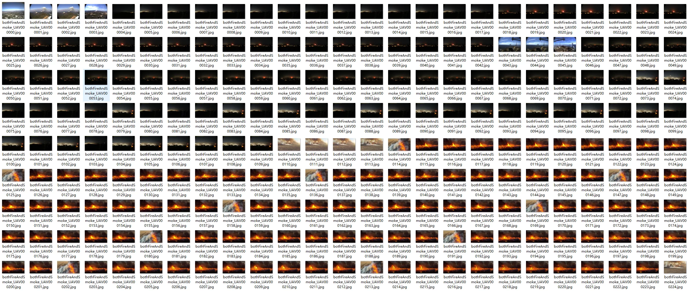
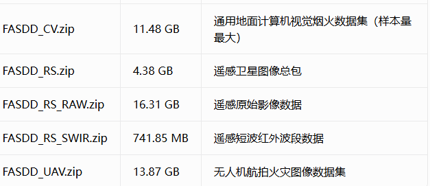
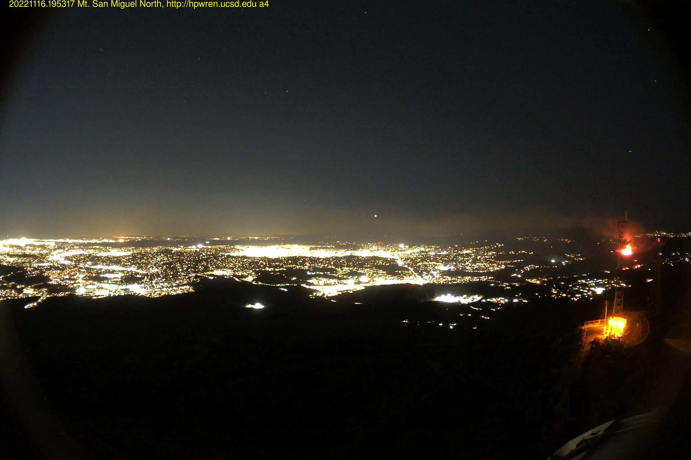
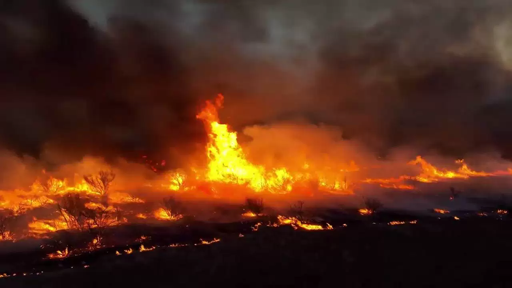
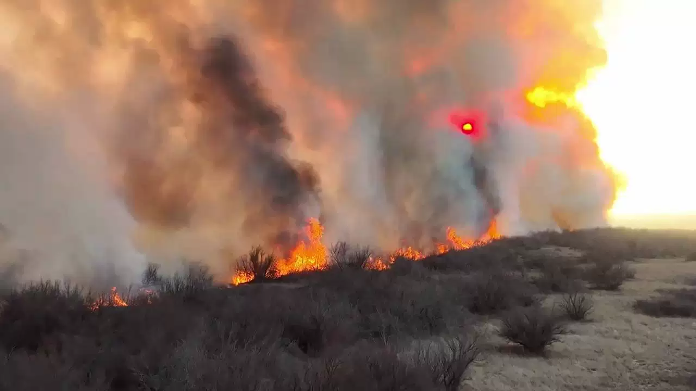

## Body

The General Fire and Smoke Detection Dataset includes multiple annotation formats.

Overall, there are 122634 samples: 70581 positive fire samples and 52073 negative no-fire samples; including 113154 flame instances and 73072 smoke instances.

FASDD_CV: 95314 images from general camera devices, with a wide range of image sizes and aspect ratios.
FASDD_UAV: 25097 UAV aerial photography images, mainly in the 4:3~16:9 aspect ratio.
FASDD_RS: 2223 satellite remote sensing images, along with an RS_SWIR short wave infrared pseudocolor image package.

Each subpackage contains the original image folder and the annotation folder, providing four mainstream annotation formats: YOLO / VOC / COCO / TDML.

The General Fire and Smoke Detection Dataset is an academic learning dataset for target detection of fire and smoke targets, with high scene complexity, covering various distances, day and night lighting conditions, indoor and outdoor environments, and also containing easily confused negative samples. It can be used as a benchmark for fire detection model learning, adaptable to multi-end observation scenarios such as monitoring, drones, and satellites.

Electronic virtual products sold without return or exchange.

## Images

item_1058855709931

Here is a pay link on Stripe ( https://buy.stripe.com/3cs8yP7sY87d0vu9AB ). Please contact me lonlonago@foxmail.com after funding $89, and I will send you a complete data files , thank you!

